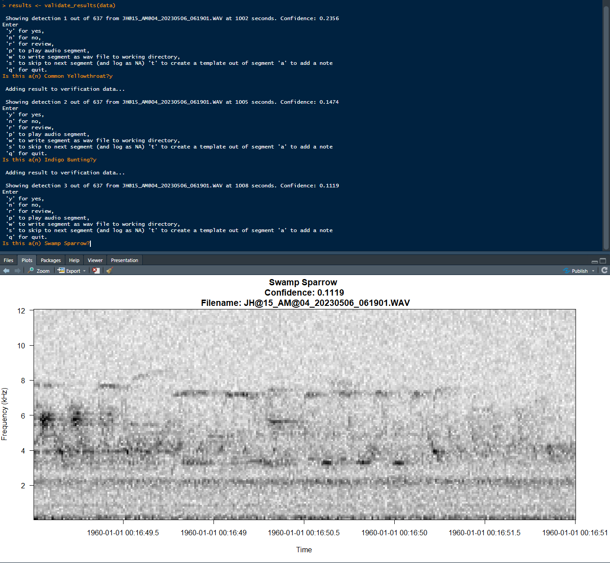
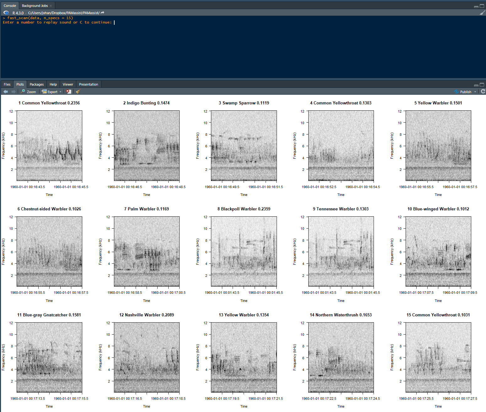

# PAMassist is an R package to help steamline analysis of detection data in passive acoustic monitoring projects


## Getting Started
Most functions within this package take dataframes of detection data as their input. These functions assume the existence of a few essential columns and will be fully compatible with detection data returned by BirdNET (assuming the .csv or R output files were chosen). They also assume the original audio files are accessible. If not using BirdNET, just make sure your detection data has the following columns:

* filepath
    * a column with the filepath to the orginial audio file
* start
    * the start time, in seconds, of the detection window
* end
    * the end time, in seconds, of the detection window
* common_name
    * character string indicating the common name of the detected species 
* confidence
    * with BirdNET data, this will be a numerical score indicating confidence in the detection result. Functions will still work without this by creating a 'dummy' confidence column and populating it with zeros.
### Installation
You can install this in R easily. You'll first need to install the devtools package.

```
install.packages("devtools")
```
Once you've installed that (or if you had it already), you can install PAMassist with the following line of code:

```
devtools::install_github("yourusername/yourreponame")
```
## Usage

There are a number of functions that will help process data, but the primary function for streamlining the manual validation process is validate_results(). This function takes in a detection dataframe and shows you a spectrogram of each detection one at a time, allowing you to make a validation entry as to whether or not the prediction is accurate.

You can run it with its default arguments like this:
```
results <- validate_results(data)
```
Here, 'data' refers to a dataframe with the above mentioned columns. You should store the results in an object, but if you don't, when the function is done running, it will give you an option to save as a .csv file. The returned dataframe and/or the downloaded .csv file will be identical to the orginial with a column added for 'verification' status and a column added for 'notes'

A couple of the other arguments you can input are...
* species: a character string or a vector of character strings indicating species names (that match your names in the common_name column)
* conf: this will filter out any detections below the input value

This function uses a prompt-based interface in the console. It will display a spectrogram, ask you a verification question and await input from the user. The user can input:

- 'y' for yes, indicating that the prediction was correct
- 'n' for no, indicating that it was not correct
- 'r' for review, indicating that it should be reviewed later
- 's' for skip, leaving NA in the verification column
- 'b' for back, to return to the previous detection
- 'p' to play the audio aloud
- 'w' to write a short .wav file to the working directory of the detection window
- 'a' to make a note about the detection, which will go in the notes column
- 'q' to quit and optionally save as a .csv. NOTE: you should definitely quit this way, because hitting ESC or terminating the session in any other way will make you lose the verification info you had input up until that point.

Here is an example of what this looks like:



This function is extremely helpful when validating detection data, especially when filtered by species so the annotator is looking only for specific species calls rather than having to keep in mind vocalizations from all potential species.

For faster scanning of detection information, the fast_scan() function displays a grid of spectrograms (default is twelve, but should be adjusted depending on how much screen space is available for viewing them.)

This can be activated just as easily with:
```
fast_scan(data)
```
For now, there is no way to make annotations on the data seen, so this function does not return anything. However, when using this function, you have the option to input either 'c' to continue to the next page, or a number which will play the audio of the spectrogram with the corresponding index.

This function is very helpful when looking through many false positives for specific signals. This is what it looks like:




## Other features
In addition to the functions to help with validation, there are a number of additional functions that interact with detection dataframes in helpful ways. 

* makeWaves() will download wave files for an entire detection set (so make sure you filter only to the audio you actually want to download). 
* species_count provides summary statistics about the species present in the data and their associated confidence scores
* combine_csv_files() is pretty generic, but can help combine detection data in a target directory into a single csv (helpful to combine  all detection data into a single file that can be read in and manipulated at once)
* nameFiles() allows you to point to a folder of recently collected audio files (maybe on an SD card) and rename those files by appending "locationID_equipmentID_" to whatever the base name of the file is. I use AudioMoths, so the basename of the files is YYMMDD_HHMMSS.WAV (date_time.wav). By renaming the files and encoding more information within them, it becomes easier to add this information to the detection dataframe so that you can then sort by location, date, and time.
* add.date(), add.time(), and add.locationID() all assume a very specific file naming structure: 

locationID_equipmentID_YYYYMMDD_HHMMSS.wav

This file structure can be achieved with nameFiles(). They each add a new column to the dataframe: 'date', 'time', and 'locationID'. (you'll have to save as a new object, it will not overwrite your dataframe by default). These columns are helpful, especially when all of your data from a PAM survey (millions of detections) gets lumped together, still ensuring that you can filter by spaital and temporal information.


## Collaborating

I freelance as a consultant for acoustic monitoring projects, and I would love to help you with yours!
## License

This project is licensed under the Creative Commons Attribution-NonCommercial 4.0 International (CC BY-NC 4.0) license. You are free to use, share, and adapt this work for non-commercial purposes only, as long as you give appropriate credit, provide a link to the license, and indicate if changes were made. For more information, please visit [creativecommons.org/licenses/by-nc/4.0/](https://creativecommons.org/licenses/by-nc/4.0/).

